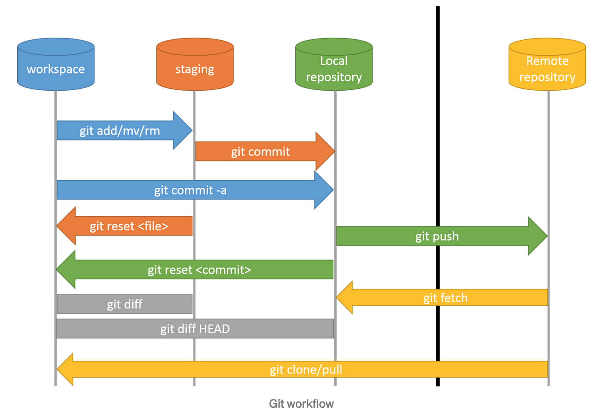
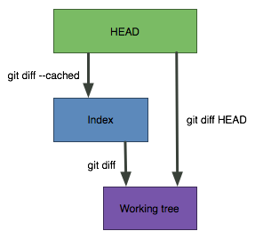
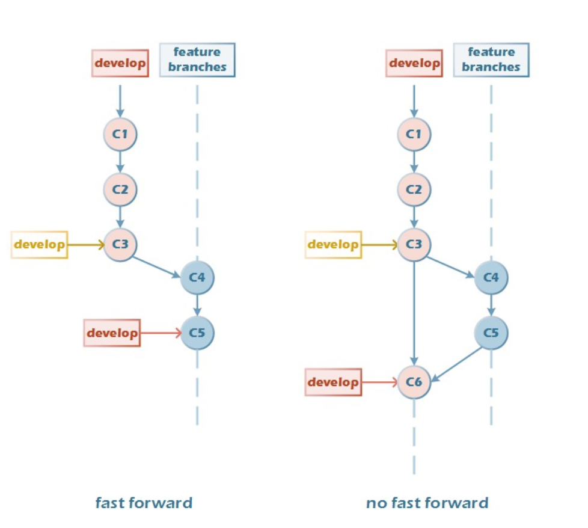
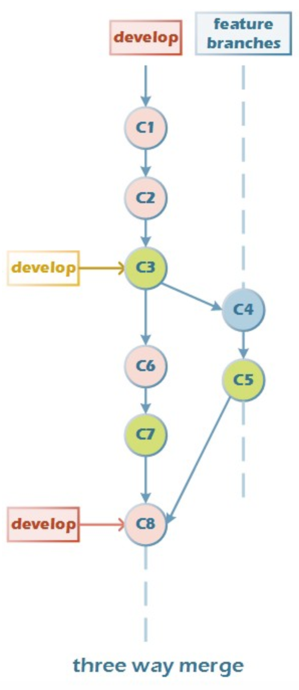
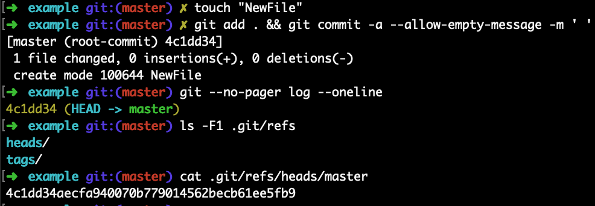
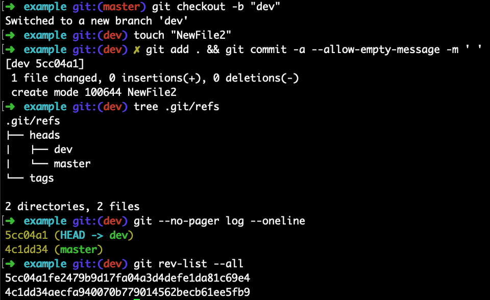

## Setup

See where Git is located:
`which git`

Get the version of Git:
`git --version`

To see the current configuration:
`git config --list`

Configure user information for all local repositories:

`git config --global user.name "[name]"`

`git config --global user.email "[email_address]"`

Create an alias (shortcut) for git status:
`git config --global alias.st status`

To get rid of a pager for all commands for all repositories:
`git config --global core.pager cat`

To use Visual Studio Code as Default Editor for Git:
`git config --global core.editor "code --wait"`

Now you can run `git config --global -e` and use VS Code as editor for configuring Git.

Help:

`git help`

`git help diff`

Get a list of contributors and the number of commits by them:
`git shortlog -sn`

## General



Git provisions 3 different areas that are the core of the repository. The first one is the `working directory` or `workspace` which is the root of your Git project, here the files go through any change that the user performs. The `staging area` (also called the `index`, `stage`, or `cache`) is where changes are built up, in this area all files are converted to tracked files by git. And the last one called as the `commit area` or `local repository` that safely stores all files already committed. There’s another area called Remote Repository, that represents the remote location of the origin repository.

With three sections, there are three main states that a file can be in at any given time: modified, committed, or staged. You modify a file any time you make changes to it in your working directory. Next, it's staged when you move it to the staging area. Finally, it's committed after a commit.

Git maintains a reference variable called `HEAD`. HEAD always points to the tip of the current branch in our repository. The Caret (`^`) is the parent of the Commit. The tilde (`~`) is a shorthand character for a row of several characters (^). The equivalence of HEAD~2 to HEAD^^. And, in the same way, the equivalence of HEAD~3 to HEAD^^^. The default used is 1, if no number is mentioned, so HEAD~ or HEAD~1 is equal to HEAD^

Initialize Git:
`git init`

Add or edit gitignore:
`nano .gitignore`

Track empty dir:
`touch dir/.gitkeep`

Get everything ready to commit:
`git add .`

Get custom file ready to commit:
`git add [filename]`

Commit changes:
`git commit -m "Message"`

Commit changes with title and description:
`git commit -m "Title" -m "Description..."`

Add and commit in one step:
`git commit -am "Message"`

Commit without commit message
`git commit -am.`

`git commit -a --allow-empty-message -m ' '`

Commit only exists in your local repository and has not been pushed to upstream repository:

`git add .`

`git commit --amend`

`git push`

Commit already pushed to upstream repository:

`git add .`

`git commit --amend`

`git push --force-with-lease`

`force` overwrites a remote branch with your local branch and it is strongly discouraged as it can destroy other commits already pushed to a shared repository.

`force-with-lease` is a safer option that will not overwrite any work on the remote branch if more commits were added to the remote branch (by another team member or coworker or what have you). It ensures you do not overwrite someone elses work by force pushing.

To specify the commit message inline:
`git commit --amend -m "New commit message"`

To use the previous commit message without changing it:
`git commit --amend --no-edit`

Remove files from Git:
`git rm [filename]`

Add files which are currently tracked ("update"):
`git add -u`

Remove file but do not track anymore:
`git rm --cached [filename]`

Move or rename files:
`git mv [filename] [new_filename]`

Undo modifications (restore files from latest commited version):
`git checkout -- [filename]`

Number of commits in a branch:
`git rev-list --count [branch-name]`

## Compare

Compare the working directory with index (staged but not yet commited): 
`git diff [filename]`

Compare the working directory with local repository:
`git diff HEAD [filename]`

Compare the staging with local repository:
`git diff --cached [filename]`

Compare modified files within the staging area:
`git diff --staged`



Compare branches:
`git diff master..[branchname]`

Compare commits:
`git --diff [old_commit] [new_commit]`

Useful comparings:
`git diff --stat --summary [commit_id]..HEAD`

Compare commits of file:
`git diff [commit_id 1]..[commit_id 2] [filename]`


## Branch
Show branches:
`git branch`

Create branch:
`git branch [branchname]`

Change to branch:
`git checkout [branchname]`

Create and change to new branch:
`git checkout -b [branchname]`

Rename the branch you have checked out:
`git branch -m [new_branchname]`

Rename another branch:
`git branch -m [branchname] [new_branchname]`

Show all completely merged branches with current branch:
`git branch --merged`

Delete merged branch (only possible if not HEAD):
`git branch -d [branchname]`

Delete not merged branch:
`git branch -D [branchname]`

List all branches:
`git branch -a`

List remote branches:
`git branch -r`

To verify which remote branches your local branches are tracking:
`git branch -vv`

Switch to the previous branch
`git checkout -`

Delete remote branch
`git push origin --delete [remote_branchname]`

Push branch to remote:
`git push -u [remotename] [branchname]`

By default, git pushes the local branch to a remote branch with the same name. For example, if you have a local called _new-feature_, if you push the local branch it will create a remote branch _new-feature_ as well.
If you want to use a different name for the remote branch, append the remote name after the local branch name, separated by : 

`git push [remotename] [local_branchname]:[remore_branchname]`

Track upstream branch:
`git branch -u origin/[branchname]`

List local branches that contain a specific commit:
`git branch --contains [commit_id]`

## Log
Show commits:
`git log`

Show oneline-summary of commits:
`git log --oneline`

Show oneline-summary of commits with full SHA-1:
`git log --format=oneline`

Show oneline-summary of the last three commits:
`git log --oneline -3`

Show only custom commits:

`git log --author="Sven"`

`git log --grep="Message"`

Show only custom data of commit:

`git log --format=short`

`git log --format=full`

`git log --format=fuller`

`git log --format=email`

`git log --format=raw`

Show changes:
`git log -p`

Show only the last two entries:

`git log -p -2`

Show every commit since special commit for custom file only:
`git log [commit_id].. [filename]`

Show changes of every commit since special commit for custom file only:
`git log -p [commit_id].. [filename]`

Show stats and summary of commits:
`git log --stat --summary`

Show history of commits as graph:
`git log --graph`

Show history of commits as graph-summary:
`git log --oneline --graph --all --decorate`

Colorize Logs:
`git log --graph --pretty=format:'%Cred%h%Creset %C(yellow)%an%d%Creset %s [%N] %Cgreen(%ar)%Creset' --date=relative`

Log between two branches:
`git log [branchname_1]..[branchname_2]`

It will show the commits that are on _[branchname_2]_ and not on _[branchname_1]_.

View commit history of a file:
`git log --follow -p [filename]`
## Collaborate

Show remote:
`git remote`

Show remote details:
`git remote -v`

Add remote upstream from GitHub project:
`git remote add upstream https://github.com/user/project.git`

Add remote upstream from existing empty project on server:
`git remote add upstream ssh://root@123.123.123.123/path/to/repository/.git`

Fetch:
`git fetch upstream`

The command `git fetch [remotename]` can then be used to create and update remote-tracking branches [remotename]/[branchname].

Fetch a custom branch:
`git fetch upstream [branchname]:[local_branchname]`

Merge fetched commits:
`git merge upstream/master`

Change your remote url:
`git remote set-url origin https://localserver/develop/myrepo.git`

Remove origin:
`git remote rm origin`

Create and checkout branch from a remote branch:
`git checkout -b [local_branchname] upstream/[remote_branchname]`

Compare:
`git diff origin/master..master`

Push (set default with `-u`):
`git push -u origin master`

Push:
`git push origin master`

Force-Push:
`git push origin master --force`

Pull:
`git pull`

Pull specific branch:
`git pull origin [branchname]`

Clone to localhost folder:
`git clone https://github.com/user/project.git ~/dir/folder`

Clone specific branch to localhost:
`git clone -b [branchname] https://github.com/user/project.git`

Delete remote branch (push nothing):
`git push origin --delete [branchname]`


## Reset

This usage of git reset is a simple way to undo changes that haven’t been shared with anyone else.

Unstage a file if not commited:

If you moved a file into the staging area with git add, but no longer want it to be part of a commit, you can use git reset to unstage that file:

`git reset helloworld.txt`

The changes you made will still be in the file, this command just removes that file from your staging area.

`git reset --soft`

This git command will only move the HEAD. And, your staging area and working directory will not be affected.

`git reset --mixed` or `git reset`

This git command will move the HEAD and also update the staging area. So this command will undo content added by git add and by git commit.

`git reset --hard`

 Dangerous! Use the following for resetting the staging area and the working directory to correspond to the last commit. It will unstage changes overwriting all changes in the working directory, too.

Undo last commit:

`git reset HEAD~`

If you are removing multiple commits from the top, you can run `git reset --hard HEAD~2` to remove the last two commits. 

....edit

`git add .`

`git commit -c ORIG_HEAD`

commit with `-c ORIG_HEAD` will open an editor, which initially contains the log message from the old commit and allows you to edit it. If you do not need to edit the message, you could use the `-C` option.

Combining two (or more) commits into just one:

`git --no-pager log`

`git reset --soft HEAD~2`

Where N is the number of commits you want to join. In this example "most recent two". 

`git commit --amend --no-edit`

## Clean

Print out the list of untracked files which will be removed (dry run)
`git clean -n`

Forcefully remove untracked files:
`git clean -f`

Forcefully remove untracked directories in addition to untracked files: 
`git clean -fd`


## Revert

Undo a commit by creating a new commit:

`git revert [commit_id]`

Undo a commit which was pushed to a remote repository:

If you committed and pushed your code to the remote repository, it is HIGHLY ADVISED that you DO NOT use git reset which rewrites history.
This command creates a new commit that undoes the changes from a previous commit. This command adds new history to the project (it doesn't modify existing history).

First thing you should do is getting the list of commits that have been done so far by `git log` and identifying the commits that need to be reverted. In my case, the commit I want to revert would be ‘4dfebd1b’.

`git checkout 4dfebd1b`

`git revert 4dfebd1b`

This command will create a new commit with the “Revert” word in the beginning of the message, as you can see above. Copy the new commit hash. In my case, it would be ‘8002f5c4’. Then, push the new commit hash to a new branch in local (I created a local branch called ‘test-revert’) and push the branch to remote using commands:

`git branch test-revert 8002f5c4`

`git push origin test-revert`

You’ve got a new branch with the reverted commit changes.

Revert a series of commits:
`git revert [commit_id 1]..[commit_id 2]`

[commit_id 1] should be older than [commit_id 2].

## Merge

This example shows creating the test branch from the master branch:

`git checkout -b test master`

Before merging the two branches, you can take a look at what has changed between the branches by using `git diff test master`. Test is your source branch and master is your target branch. To perform the merge, you will have to move back to the master branch and then use the merge function like this:

`git checkout master`

`git pull origin master`

`git merge test`

Last, pushes the branch contents to the remote repository

`git push origin master`

While you are working on your branch, other developers may update the master branch with their branch. This action means your branch is now out of date of the main branch and missing content. You can merge the master branch into your branch by checking out your branch and using the same git merge command `git checkout test && git merge master`

Git performs merges two ways: `fast-forward` and `three-way`

If develop has not diverged, instead of creating a new commit, git will then simply point develop to the latest commit of the feature branch. This is a `fast-forward`. The “no-fast-forward” (`--no-ff`) merge option preserves the branch history and creates a merge commit, even if the merge could be performed with a fast-forward.



If develop has diverged since the feature branch was created, the merging the feature branch into develop will create a merge commit.
The reason it is called a `three-way` merge is because the Merge Commit is based on 3 different commits:

- The common ancestor of our branches `C3`
- The tip of the Feature branch `C5`
- The tip of the develop branch `C7`

The three parties merged C3, C5, and C7 to generate the latest `C8`



The default behavior of Git is to use fast-forwarding whenever possible.

`Squash merge` is a different merge approach. The commits of the merged branch are squashed into one and applied to the target branch. Here's an example:
```
        C - D - E           feature
      /
A - B - F - G               develop
```

`git checkout develop`

After `git merge --squash feature && git commit`:
```
        C - D - E           feature
      /
A - B - F - G - CDE         develop
```

where `CDE` is a single commit combining all the changes of C + D + E. Squashing retains the changes but discards all the individual commits of the feature branch.

Merge conflicts:

As Git is based on comparing versions of a file line-by-line, whenever a line changed in your branch coincides with the same line changed in the target branch (after the moment you created your feature branch from it), Git identifies these changes as a merge conflict. To fix it, you need to choose which version of that line you want to keep. 

`git checkout develop`

`git merge feature`

Merge the branch into develop to see the error:
>Auto-merging README.md
CONFLICT (content): Merge conflict in README.md
Automatic merge failed; fix conflicts and then commit the result.

(a) You can simply open the file in an editor, search for the conflict markers and make any necessary modifications.

It begins with the marker: `<<<<<<< HEAD`.
Below, there is the content with your changes.
The marker: `=======` indicates the end of your changes.
Below, there’s the content of the latest changes in the target branch.
The marker `>>>>>>>` indicates the end of the conflict. 

Choose which version (before or after =======) you want to keep, and then delete the portion of the content you don’t want in the file.

(b) Alternatively, you can tell Git that you'll simply go with one of the edited versions, called "ours" or "theirs"

If you want to select the version in develop:

`git checkout --ours README.md`

If you want to select the version in feature:

`git checkout --theirs README.md`

then, continue as you would normally merge

`git add README.md`

`git merge --continue`

## Rebase

Rebasing is the process of taking multiple commits and applying them on top of another base tip.

```
        C - D - E           feature
      /
A - B - F - G               develop
```

Now when we say we want to rebase the feature branch onto develop, what we are pursuing is a history that looks like this:

```
              C' - D' - E'  feature
             /
A - B - F - G               develop
```
If the currently checked out branch is feature

`git rebase develop`

Squash several commits into a single commit:

`git rebase -i --root`

Change `pick` to `squash` all lines expect the first line , for first line just change `pick` to `edit`

`git commit --amend`

Change the commit message "make several commits into one" :)

`git rebase --continue`

Your editor pops up again with a default message, made of the names of all the commits you have squashed. You can leave it as it is.

Rebasing can be dangerous! git rebase rewrites the commit history. It can be harmful to do it in **shared branches**.

You can use `git rebase -i` to rapidly sign all of your commits the correct way. Just change `pick` to `edit` for the commits in question, and do a `git commit --amend -s` (no need to change the original message!) and `git rebase --continue` for each commit.

## Tag

Tag operation allows giving meaningful names to a specific version in the repository.

List all tags
`git tag`

Create a tag reference named name for current commit. Add commit 
sha to tag a specific commit instead of current one

`git tag [name] [commit_id]`

`git push origin tag [name]`

Create a tag object named _name_ for current commit

`git tag -a [name] [commit sha]`

view more details about tag

`git show [name]`

Remove a tag from local repository as well as the remote repository

`git tag -d [name]`

`git push origin :[name]`


Checkout a tag (jump to state) 	
`git checkout [tag_name]`


Assign tag to different commit:

`git tag [tag_name] [commit_id]`


## Stash

The `git stash` command store your partial changes. By default, running git stash will stash:

- changes that have been added to your index (staged changes)
- changes made to files that are currently tracked by Git (unstaged changes)

But it will not stash:

- new files in your working copy that have not yet been staged
- files that have been ignored

Stashes are **NOT** synced with origin / remote

Adding the `-u` option (or `--include-untracked`) tells git stash to also stash your untracked files

List current stashes

`git stash list`

Save stash(es), annotated with a message (it's good practice)

`git stash save "[message]"`


By default, `git stash pop` will re-apply the most recently created stash: _stash@{0}_

You can choose which stash to re-apply by passing its identifier as the last argument

`git stash pop stash@{n}`

where `n` is the index of the stash.

View stash changes / diffs

`git stash show`

`git stash show -p` 

Delete all stashes

`git stash clear`

Delete specific stash:

`git stash drop [stash_id]`

Delete all stashes:

`git stash clear`

## Worktree

Worktree gives a extra working copy of the repository. By adding a worktree, you create a new clone of the repo in another folder and eliminate the need to needlessly commit and stash changes.

Creates work tree with with the name of the subfolder and the name of the branch specified as options:

`git worktree add [path] [branch]`

for example:

`git worktree add -b a-new/branch ../another-folder-for-your-new-worktree origin/branch-to-branch-away-from`

List all worktrees:

`git worktree list`

Prune working trees:

`git worktree prune`

few things to keep in mind:

- Removing a worktree does not delete the branch
- You cannot simultaneously check out the same branch in multiple worktrees
- You can switch branches within a worktree


## Refs and the Reflog

Git reference (Git ref) is just a file that contains a git commit’s SHA-1 hash. The most direct way to reference to a commit is via its SHA-1 hash, this acts as a unique ID for each commit. In order to refer to a commit you have to remember it’s SHA-1 hash value, so instead of remembering the SHA-1 hash value you can use `git ref` which is easy-to-remember rather than hash. We can say a ref is an indirect way of referring to commit, you can think of it as a user-friendly alias for a commit.

Refs are stored as normal text files in the `.git/refs` directory

All local branches of repository are defined in `refs/heads/` directory. Each file name matches names of the corresponding branch, and inside file, you will find a commit hash. This commit hash is the location of the tip of the branch.



The `tags` directory works the exact same way, but it contains tags instead of branches.

The `remotes` directory lists all remote repositories that you created with git remote as separate subdirectories. Inside each one, you’ll find all the remote branches that have been fetched into your repository.

Git consistently uses the term rev in plumbing commands as short for "revision" and generally meaning the 40-character SHA1 hash for a commit. The command `rev-list` for example prints a list of 40-char commit hashes for a branch or whatever.



In addition to the refs directory, there are a few special refs that reside in the top-level .git directory. They are listed below:

- `HEAD` – The currently checked-out commit/branch.
- `FETCH_HEAD` – The most recently fetched branch from a remote repo.
- `ORIG_HEAD` – A backup reference to HEAD before drastic changes to it.
- `MERGE_HEAD` – The commit(s) that you’re merging into the current branch with git merge.
- `CHERRY_PICK_HEAD` – The commit that you’re cherry-picking.

To count your commits:

`git rev-list –-count [branch_name]`

List Commits in master but not in origin/master:

`git rev-list --oneline master ^origin/master`

Finding commit that a tag points to:

`git rev-list -n 1 [tag_name]`

It’s sometimes necessary to resolve a branch, tag, or another indirect reference into the corresponding commit hash. For this, you can use the `git rev-parse` command.

The following returns the hash of the commit pointed to by the _main_ branch:

`git rev-parse main`

Find commit id 17 commits before:

`git rev-parse HEAD~17`

`git rev-parse --short HEAD~17`

Find checkout branch name:

`git rev-parse --abbrev-ref HEAD`


The `reflog` is a special mechanism that contains any changes to the data in your repository. This includes commiting changes, creating and checking out branches, and even hard resets.

Be default, git reflog outputs the reflog of the HEAD reference, which is considered to be an iconic reference to the branch, which is currently active. 

Execute the following command for getting the entire reflog of all the references:

`git reflog show --all`

git reflog doesn’t last forever. Git will periodically clean up objects which are “unreachable.”

Restore a deleted branch:

Find the 'sha' for the commit at the tip of your deleted branch using

`git reflog`

To restore the branch, use

`git checkout -b [branch_name] [commit_sha]`

## Submodules and Subtree

Submodules are just normal Git repositories. However, they are cloned into a subdirectory of another project.

When you add a submodule in Git, you don't add the code of the submodule to the main repository, you only add information about the submodule that is added to the main repository. This information describes which commit the submodule is pointing at. This way, the submodule's code won't automatically be updated if the submodule's repository is updated. This is good, because your code might not work with the latest commit of the submodule, it prevents unexpected behaviour.

You can add a submodule to a repository like this:

`git submodule add git@github.com:url_to/awesome_submodule.git third_party/awesome_submodule`

After this operation, if you do a git status you'll see two files in the Changes to be committed list: the `.gitmodules` file and the path to the submodule. When you commit and push these files you commit/push the submodule to the origin.

```
$ cat .gitmodules 
[submodule "third_party/awesome_submodule"]
	path = third_party/awesome_submodule
	url = git@github.com:url_to/awesome_submodule.git
```

Submodules are really just standard Git repositories. You can modify, commit, pull, push, etc. from inside it like with any other repository.

To update the code of your submodules, you should run:

`git submodule update --remote`

If you’re cloning repo for the first time, you can use a modified clone command to ensure you download everything, including any submodules:

`git clone --recursive [project_url]`

If you forgot to clone with recurse on

`git submodule update --init --recursive`

Remember that Git doesn’t download submodule contents by default. **If you’re adding a submodule to an existing project, make sure anyone that works on the project knows they need to run commands like `git submodule update` and `git clone --recursive` to ensure they get everything.**

##oneliner

`git log --pretty=format:"%h %ad | %s %d [%an]" --after="2023-02-10 12:00:00" --until="2023-02-11"`
